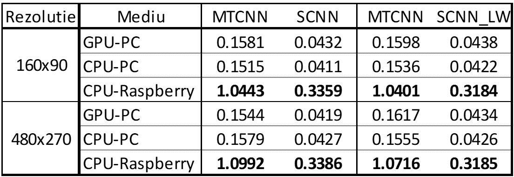
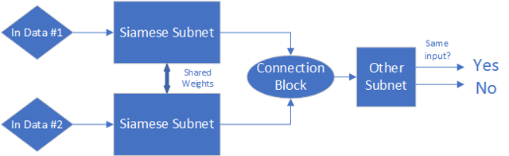
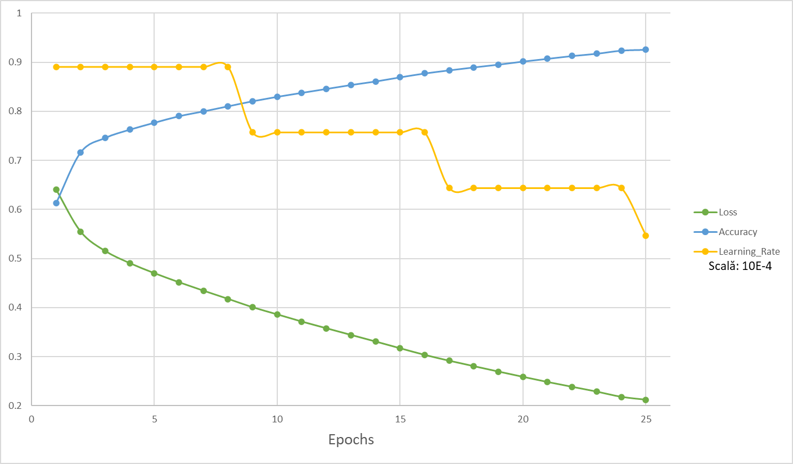
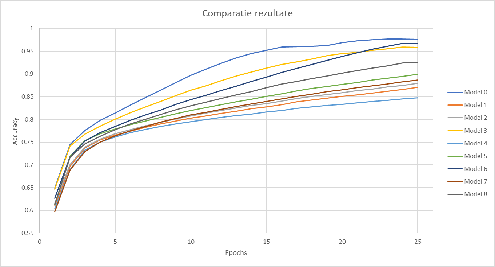
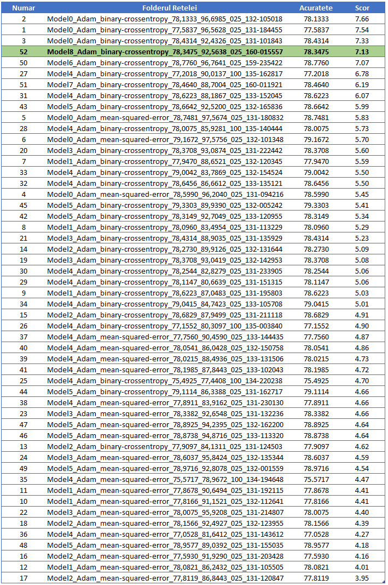

# Embedded artificial system for automatic access control
## Dissertation degree project

### Introduction
The targeted application is a system mounted on a video camera that allows the identification of people at the entrance of a secured building. To achieve this goal I have generated a dataset containing relevant information - such as the faces of several people looking at different angles, then developed several Siamese architectures that I trained, validated and tested.

## Initial Data Flow
Images fetched from camera are preprocessed and afterwards are feed to one of two entries of the network. The other entry receive images from database. The following step is to the extract the faces from the image and encode them into a vector of length 128 with values between (-1;1). Last step is to determine the similarities between the encoded faces and to determine if it is the same person in both images.

## Final Data Flow
An optimization that I've done it was to skip recalculating the images from database on each execution, so the images from database were precalculated and were feed only to comparation step.

## Some training results

